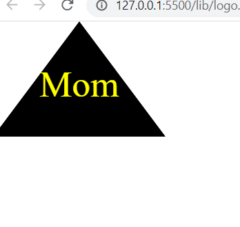

## SVG-logo-maker

The SVG Logo Maker is an application that empowers users to input up to three characters, select text color, and choose from a variety of shapes including circles, triangles, and squares. Upon entering the desired inputs, the application generates an SVG file named 'logo-SVG', which can be conveniently viewed in the browser as a high-quality image with dimensions of 300x200 pixels.

## link

[Github](https://github.com/siahmoymajid/SVG-logo-maker)

## Screenshots

